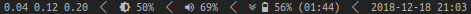

# dwm-status
[](https://github.com/Gerschtli/dwm-status/actions)
[](https://crates.io/crates/dwm-status)
[](http://opensource.org/licenses/MIT)

DWM status service which dynamically updates when needed.
Heavily inspired by [i3status-rust](https://github.com/greshake/i3status-rust).

Example status bar:


## Requirements

`cargo`, `rustc` and `lib{dbus,gdk-pixbuf,notify,x11}-dev` are required to build the binary.

## Build and run

```sh
$ # dev mode
$ cargo run -- <config-file>
$ # release mode
$ cargo build --release
$ ./target/release/dwm-status <config-file>
```
Or install globally to `~/.cargo/bin`:
```sh
$ cargo install dwm-status
```

### [Nix](https://nixos.org/nix/) support

Build as flake:
```sh
$ nix build
```

And run:
```sh
$ ./result/bin/dwm-status <config-file>
```

## Configuration

The `config-file` can be a HJSON, JSON, TOML or YAML file. For each possible format a config file filled with the
default values can be found in `examples/default-settings`. The type of file is determined by its suffix.

For an example how to use icons in the status bar see `examples/icon-settings/nerd-font.toml`. You need to install and
specify one of the available [nerd fonts](https://nerdfonts.com) in your `config.h` in `dwm` to use the icons in the
example config, e.g.:
```c
static const char *fonts[] = { "Ubuntu Mono Nerd Font:size=9" };
```

### General options

| name        | default | description                                                             |
| ----------- | ------- | ----------------------------------------------------------------------- |
| `debug`     | -       | Deprecated, will be removed in 2.0.0. Log level is now INFO by default. |
| `order`     | `[]`    | List of enabled features in order.                                      |
| `separator` | `" / "` | Separator string between each feature.                                  |

### Feature: Audio

**Note:** `alsa-utils` are required.

Shows status of configured alsa control device. Listens on `alsactl monitor` for changes.

#### Configuration options

| name       | default      | description                                                                     |
| ---------- | ------------ | ------------------------------------------------------------------------------- |
| `control`  | `"Master"`   | Alsa control device to listen for.                                              |
| `icons`    | `[]`         | List of icons, which represent different stages relative to the current volume, e.g. `["LOW", "MIDDLE, "HIGH"]`.     |
| `mute`     | `"MUTE"`     | Text representation if muted.                                                   |
| `template` | `"S {VOL}%"` | Text representation if unmuted. (`{VOL}` gets replaced with the current volume, `{ICO}` gets replaced with the icon) |

### Feature: Backlight

Shows status of backlight value and watches `/sys/class/backlight` for changes.

#### Configuration options

| name       | default             | description                                                                  |
| ---------- | ------------------- | ---------------------------------------------------------------------------- |
| `device`   | `"intel_backlight"` | Backlight device in `/sys/class/backlight`.                                  |
| `icons`    | `[]`                | List of icons, which represent different stages relative to the current value, e.g. `["LOW", "MIDDLE, "HIGH"]`.   |
| `template` | `"L {BL}%"`         | Text representation. (`{BL}` gets replaced with the current backlight value, `{ICO}` gets replaced with the icon) |

### Feature: Battery

**Note:** The `upower` daemon has to be running for receiving DBus messages.

Watches UPower DBus signals for added or removed batteries and changes of battery states.

If notifier is enabled, currently discharging and the capacity of the fullest battery is under the configured values
value, warning notifications with urgency normal or critical (depending on the configured critical value) are sent.

Shows following information per battery:

| status               | example          | notes                        |
| -------------------- | ---------------- | ---------------------------- |
| charging             | `▲ 10% (01:23)` | In parentheses time to full  |
| discharging          | `▼ 50% (02:03)` | In parentheses time to empty |

Shows following information as feature block (`ICO` gets replaced with an icon if any are defined):

| battery count | example                       | notes                                    |
| ------------- | ----------------------------- | ---------------------------------------- |
| 0             | `NO BATT`                     |                                          |
| 1             | `▼ ICO 50% (02:03)`           |                                          |
| 2             | `▼ ICO 50% (02:03) · ICO 50%` | Batteries ordered alphabetically by name |

#### Configuration options

| name                | default              | description                                                |
| ------------------- | -------------------- | ---------------------------------------------------------- |
| `charging`          | `"▲"`               | Text representation for status charging.                   |
| `discharging`       | `"▼"`               | Text representation for status discharging.                |
| `enable_notifier`   | `true`               | Whether to enable the notifier.                            |
| `icons`             | `[]`                 | List of icons, which represent different stages relative to the current battery state, e.g. `["LOW", "MIDDLE, "HIGH"]`. |
| `no_battery`        | `"NO BATT"`          | Text representation if no battery present.                 |
| `notifier_critical` | `10`                 | Maximum battery value to notify via critical notification. |
| `notifier_levels`   | `[2, 5, 10, 15, 20]` | Battery values to notify.                                  |
| `separator`         | `" · "`              | Separator string between mutliple battery infos.           |

### Feature: CPU Load

Shows CPU load taken from `/proc/loadavg` in configured format and refreshes every `n` seconds.

#### Configuration options

| name              | default                | description                 |
| ----------------- | ---------------------- | --------------------------- |
| `template`        | `"{CL1} {CL5} {CL15}"` | Text representation. (`{CLx}` gets replaced with the load of last `x` minutes for `x` in `{1, 5, 15}`) |
| `update_interval` | `20`                   | Update interval in seconds. |

### Feature: Network

**Note:** The commands `ip`, `dig` and `iwgetid` need to be in `PATH`.

Shows connected ESSID, public IPv4 and IPv6 address. Updates get triggered by listening on `ip monitor address link`.

#### Configuration options

| name       | default                       | description                     |
| ---------- | ----------------------------- | ------------------------------- |
| `no_value` | `"NA"`                        | Value for not defined elements. |
| `template` | `"{IPv4} · {IPv6} · {ESSID}"` | Text representation. Placeholders surrounded by curly braces are `{IPv4}`, `{IPv6}` and `{ESSID}`. |

### Feature: Time

Shows time in configured format and refreshes every second or minute.

#### Configuration options

| name             | default             | description                                                          |
| ---------------- | ------------------- | -------------------------------------------------------------------- |
| `format`         | `"%Y-%m-%d %H:%M"`  | Time format of [chrono crate](https://github.com/chronotope/chrono). |
| `update_seconds` | `false`             | Whether to update time feature every second or minute, automatically set by parsing `format`. |

## Contributing

You need `rustup` with nightly toolchain, rustfmt, clippy and `lib{dbus,gdk-pixbuf,notify,x11}-dev`. I recommend the
installation of racer.

If your are using [nix](https://nixos.org/nix) you can use `shell.nix` for all dependencies except the `rustup`
toolchain and components:

```sh
$ nix-shell
[nix-shell]$ rustup install nightly
[nix-shell]$ rustup default nightly
```
